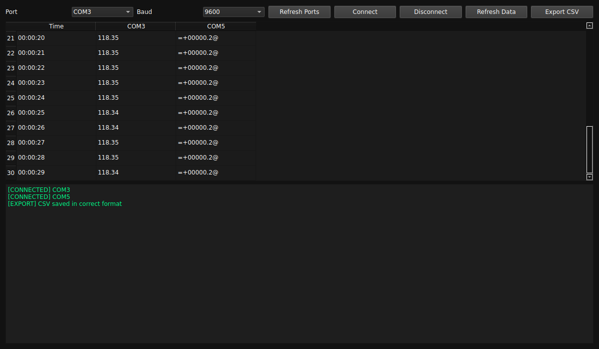

# Multi Serial Monitor

**QLB9 Industrial Load Cell Dashboard** — a Windows desktop app that reads several load-cell indicators over serial (COM) ports at the same time, shows their live readings side by side in one time-aligned table, and logs everything to CSV.

Built with Python + PyQt6, packaged as a standalone `.exe` with PyInstaller.

**[⬇ Download the latest .exe](https://github.com/thisisdibbo/MultiserialMonitor/releases/latest)**



---

## Why

Most serial monitors (including the Arduino IDE's) talk to **one** port at a time. If you have four QLB9 indicators — or any device that streams weight/force readings over USB-serial — you end up with four separate windows and four separate logs with no common timebase.

This app connects to all of them at once and writes a single wide-format table:

```
Time,COM3,COM4,COM5
00:00:11,=-00001.1@,=+00000.0@,=+00002.3@
00:00:12,=-00004.7@,=+00000.1@,=+00002.2@
```

One row per second, one column per port. Straight into Excel, MATLAB, or pandas.

---

## Features

- **Multi-port capture** — connect any number of COM ports simultaneously; each runs on its own thread so one slow device never blocks the others
- **Live table** — a new row every second with the latest reading from every connected port, auto-scrolling
- **Auto port discovery** — `Refresh Ports` lists available COM ports; a background scan runs every 2 s
- **Selectable baud rate** — 9600 / 19200 / 38400 / 57600 / 115200
- **Continuous CSV logging** — writes `loadcell_data.csv` next to the app, flushed every second, so nothing is lost if the app is closed or crashes
- **Export on demand** — `Export CSV` saves the full buffered session as a clean wide-format matrix wherever you choose
- **Numeric filtering** — only tokens containing at least one digit are kept, so device banners and junk bytes don't pollute the log
- **Event log pane** — connect / disconnect / export / error messages
- **Dark UI** — easy on the eyes during long test runs

---

## How it works

```
COM port ──┐
COM port ──┼── SerialWorker threads ──► latest_data{}  ──► 1 Hz timer ──┬──► live table
COM port ──┘        (one per port)     time_buffer{}                    └──► CSV writer
```

Each `SerialWorker` opens its port with a 0.2 s read timeout and accumulates bytes into a buffer. `\r` is normalised to `\n`, the buffer is split into complete lines, and the first whitespace-separated token of each line is taken as the reading. If it contains a digit, it is emitted to the UI thread via a Qt signal.

The UI keeps two stores:

- `latest_data` — the most recent value per port, used for the live table and the rolling CSV
- `time_buffer` — `{timestamp: {port: value}}`, the full session history used by `Export CSV`

Three `QTimer`s drive everything: port scan (2 s), table row insert (1 s), CSV row write (1 s).

---

## Data format

QLB9 indicators stream frames like `=+00000.0@` / `=-00004.7@`:

| Part | Meaning |
|---|---|
| `=` | frame start |
| `+` / `-` | sign |
| `00004.7` | reading |
| `@` | frame end |

The app stores these verbatim — it does **not** strip the delimiters or convert to float. Parse them downstream, e.g.:

```python
import pandas as pd

df = pd.read_csv("loadcell_data.csv")
for col in df.columns[1:]:
    df[col] = df[col].astype(str).str.strip("=@").astype(float)
```

Framing is not required. Any device that prints a numeric value per line works, and formats can be mixed in one session — the sample log has a QLB9 indicator on one port (`=+00000.2@`) and a plain float stream on another (`118.35`) side by side.

---

## Install

### Run the prebuilt executable

Grab `dist/Multi Serial Monitor.exe` and double-click it. No Python needed. `loadcell_data.csv` is written to the working directory.

### Run from source

```bash
git clone https://github.com/thisisdibbo/MultiserialMonitor.git
cd MultiserialMonitor
pip install pyqt6 pyserial
python main.py
```

Requires Python 3.9+.

### Build the executable yourself

```bash
pip install pyinstaller
pyinstaller "Multi Serial Monitor.spec"
```

Output lands in `dist/`. The spec builds a single-file, windowed (no console) exe with `app.ico`.

---

## Usage

1. Plug in the indicators and launch the app
2. Click **Refresh Ports**
3. Pick a port, pick the baud rate, click **Connect** — repeat for each device
4. Readings start filling the table; a column is added per connected port
5. **Refresh Data** clears the table and buffer to start a fresh run
6. **Export CSV** writes the whole session to a file of your choosing
7. **Disconnect** releases the selected port

---

## Project layout

```
MultiserialMonitor/
├── main.py                      # entire application
├── Multi Serial Monitor.spec    # PyInstaller build config
├── app.ico                      # application icon
└── dist/
    ├── Multi Serial Monitor.exe # prebuilt binary
    └── loadcell_data.csv        # sample/auto log output
```

---

## Notes & limitations

- **Windows-oriented.** The code itself is cross-platform (PyQt6 + pyserial), but port names are COM-style and only a Windows binary is shipped. On Linux/macOS run from source; ports appear as `/dev/ttyUSB0`, `/dev/tty.usbserial-*`, etc.
- **`loadcell_data.csv` is overwritten** on every launch (opened in `w` mode). Rename or move it before restarting if you need to keep a run.
- **Column set is fixed at first write.** The rolling CSV writes its header once, from the ports connected at that moment — ports connected later get appended as unlabelled columns (visible in the sample file above). Use **Export CSV** for a clean, fully-aligned matrix.
- **One sample per second.** Sampling is timer-driven, not event-driven, so faster device output is decimated to the latest value each second.
- Disconnect ports before unplugging hardware to avoid a stale handle.

---

## License

MIT — see [LICENSE](LICENSE).

---

Built by [@thisisdibbo](https://github.com/thisisdibbo).
